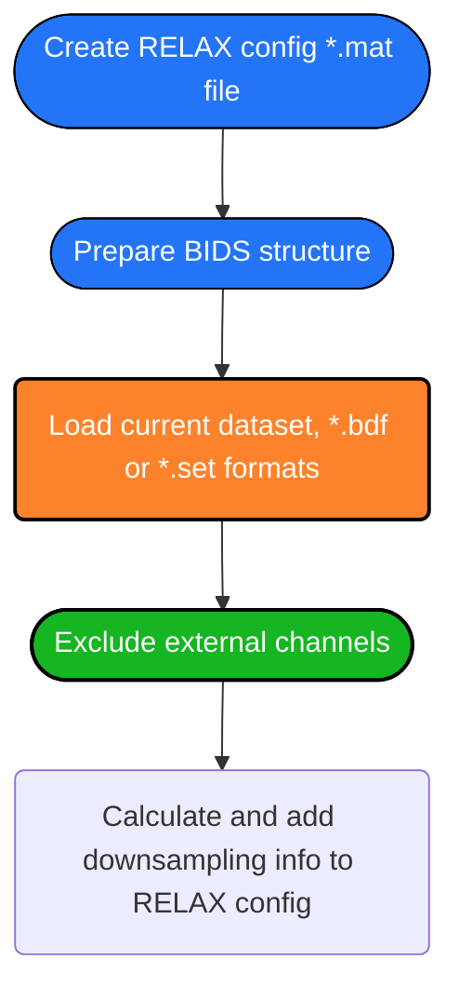

```mermaid
flowchart TD
%% Colors %%

classDef blue fill:#2374f7, stroke:#000, stroke-width: px, color:#fff
classDef orange fill:#fc822b,stroke:#000,stroke-width:2px,color:#fff
classDef green fill:#16b522,stroke:#000,stroke-width:2px,color:#fff
classDef mintgreen fill:#4DAB9A,stroke:#000,stroke-width:2px,color:#fff
classDef mandarine fill:#FFA344,stroke:#000,stroke-width:2px,color:#fff
classDef aubergine fill:#9A6DD7,stroke:#000,stroke-width:2px,color:#fff
classDef red fill:#D44C47,stroke:#000,stroke-width:2px,color:#fff
classDef grey fill:#979A9B,stroke:#000,stroke-width:2px,color:#fff


Config([Create RELAX config *.mat file]):::blue -->
BIDS([Prepare BIDS structure]):::blue
click Config "https://github.com/deebeebolger/Project_CeLaVie/blob/main/DataflowChart_pages/Create_RELAX_conf_file.md" "Link"
click BIDS "https://github.com/deebeebolger/Project_CeLaVie/blob/main/DataflowChart_pages/BIDS_structure.md" "Link"
BIDS --> Ld(Load current dataset, *.bdf or *.set formats):::orange
--> EXRej([Exclude external channels]):::green
click EXRej "https://github.com/deebeebolger/Project_CeLaVie/blob/main/DataflowChart_pages/Exclude_external_chans.md" _blank
EXRej --> AddRS(Calculate and add downsampling info to RELAX config)


```
