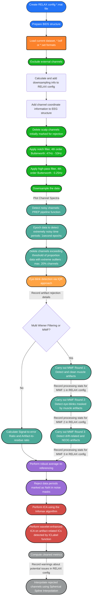

| :exclamation:  Click on each block of the dataflow chart to view details.    |

```mermaid
flowchart TD
%% Colors %%

classDef blue fill:#2374f7, stroke:#000, stroke-width: px, color:#fff
classDef orange fill:#fc822b,stroke:#000,stroke-width:2px,color:#fff
classDef green fill:#16b522,stroke:#000,stroke-width:2px,color:#fff
classDef mintgreen fill:#4DAB9A,stroke:#000,stroke-width:2px,color:#fff
classDef mandarine fill:#FFA344,stroke:#000,stroke-width:2px,color:#fff
classDef aubergine fill:#9A6DD7,stroke:#000,stroke-width:2px,color:#fff
classDef red fill:#D44C47,stroke:#000,stroke-width:2px,color:#fff
classDef grey fill:#979A9B,stroke:#000,stroke-width:2px,color:#fff


Config([Create RELAX config *.mat file]):::blue -->
BIDS([Prepare BIDS structure]):::blue
click Config "https://github.com/deebeebolger/Project_CeLaVie/blob/main/DataflowChart_pages/Create_RELAX_conf_file.md" "Link"
click BIDS "https://github.com/deebeebolger/Project_CeLaVie/blob/main/DataflowChart_pages/BIDS_structure.md" "Link"
BIDS --> Ld(Load current dataset, *.bdf or *.set formats):::orange
--> EXRej([Exclude external channels]):::green
click EXRej "https://github.com/deebeebolger/Project_CeLaVie/blob/main/DataflowChart_pages/Exclude_external_chans.md" _blank
EXRej --> AddRS(Calculate and add downsampling info to RELAX config)
click AddRS "https://github.com/deebeebolger/Project_CeLaVie/blob/main/DataflowChart_pages/Downsampling.md" "Link"
AddRS --> AddChan(Add channel coordinate information to EEG structure)
click AddChan "https://github.com/deebeebolger/Project_CeLaVie/blob/main/DataflowChart_pages/Add_Channels_coordinates.md" "Link"
AddChan --> ScalpRej([Delete scalp channels initially marked for rejection]):::green
ScalpRej --> Notch([Apply notch filter, 4th order Butterworth: 47Hz - 53Hz]):::green
Notch --> HPfilt([Apply high-pass filter, 4th order Butterworth : 0.25Hz]):::green
HPfilt --> RSamp([Downsample the data]):::green
click Notch "https://github.com/deebeebolger/Project_CeLaVie/blob/main/DataflowChart_pages/Filtering.md" "Link"
click HPfilt "https://github.com/deebeebolger/Project_CeLaVie/blob/main/DataflowChart_pages/Filtering.md" "Link"
RSamp -->|Plot Channel Spectra|Prep([Detect noisy channels: PREP pipeline function]):::mintgreen
Prep --> EpClean([Epoch data to detect extremely noisy time periods: 1second epochs]):::mintgreen
click Prep "https://github.com/deebeebolger/Project_CeLaVie/blob/main/DataflowChart_pages/BadChannelDetect_PREP.md" "Link"
click EpClean "https://github.com/deebeebolger/Project_CeLaVie/blob/main/DataflowChart_pages/Bad_ChannelTime_Detect_MAD.md" "Link"
EpClean --> DelChans([Delete channels exceeding threshold of proportion data with extreme outliers : max. 20% channels]):::mintgreen
click DelChans "https://github.com/deebeebolger/Project_CeLaVie/blob/main/DataflowChart_pages/Bad_ChannelTime_Detect_MAD.md" "Link"
DelChans --> Blink([Eye-blink detection via IQR approach]):::mandarine
Blink -->|Record artifact rejection details|SerArrChoice{Multi Wiener Filtering or MWF?}
click Blink "https://github.com/deebeebolger/Project_CeLaVie/blob/main/DataflowChart_pages/EyeBlink_detection.md" "Link"
SerArrChoice -->|No|DoSerArr([Calculate Signal-to-error Ratio and Artifact-to-residue ratio]):::mintgreen
SerArrChoice -->|Yes| MWF1([Carry out MWF Round 1: Detect and clean muscle artifacts]):::mintgreen
MWF1 -->|Record processing stats for MWF 1 in RELAX config| MWF2([Carry out MWF Round 2: Detect eye-blinks masked by muscle artifacts]):::mintgreen;
click MWF1 "https://github.com/deebeebolger/Project_CeLaVie/blob/main/DataflowChart_pages/Multichannel_WTF_round1.md" "Link"
MWF2 --> |Record processing stats for MWF 2 in RELAX config| MWF3([Carry out MWF Round 3: Detect drift-related and hEOG artifacts]):::mintgreen
click MWF2 "https://github.com/deebeebolger/Project_CeLaVie/blob/main/DataflowChart_pages/Multichannel_MWF_round2.md" "Link"
DoSerArr --> Reref([Perform robust average re-referencing]):::aubergine
MWF3 -->|Record processing stats for MWF 3 in RELAX config| Reref:::aubergine
click MWF3 "https://github.com/deebeebolger/Project_CeLaVie/blob/main/DataflowChart_pages/Multichannel_MWF_round3.md" "Link"
Reref --> Nanrej([Reject data periods marked as NaN in noise masks]):::aubergine
click Reref "https://github.com/deebeebolger/Project_CeLaVie/blob/main/DataflowChart_pages/RobustAveraging_Rereferencing.md" "Link"
Nanrej --> ICAInfomax([Perform ICA using the Infomax algorithm]):::red
ICAInfomax --> wICA([Perform wavelet-enhanced ICA on artifact-related ICs detected by ICLabel function]):::red
wICA --> CCM([Compute cleaned metrics]):::grey
CCM -->|Record warnings about potential issues in RELAX config|Interp([Interpolate rejected channels using Spherical Spline Interpolation]):::grey
```
