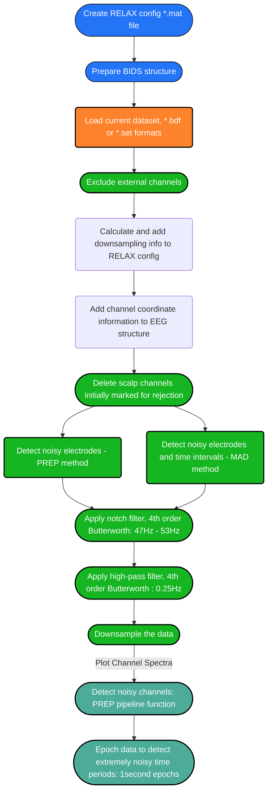

```mermaid
flowchart TD
%% Colors %%

classDef blue fill:#2374f7, stroke:#000, stroke-width: px, color:#fff
classDef orange fill:#fc822b,stroke:#000,stroke-width:2px,color:#fff
classDef green fill:#16b522,stroke:#000,stroke-width:2px,color:#fff
classDef mintgreen fill:#4DAB9A,stroke:#000,stroke-width:2px,color:#fff
classDef mandarine fill:#FFA344,stroke:#000,stroke-width:2px,color:#fff
classDef aubergine fill:#9A6DD7,stroke:#000,stroke-width:2px,color:#fff
classDef red fill:#D44C47,stroke:#000,stroke-width:2px,color:#fff
classDef grey fill:#979A9B,stroke:#000,stroke-width:2px,color:#fff


Config([Create RELAX config *.mat file]):::blue -->
BIDS([Prepare BIDS structure]):::blue
click Config "https://github.com/deebeebolger/Project_CeLaVie/blob/main/DataflowChart_pages/Create_RELAX_conf_file.md" "Link"
click BIDS "https://github.com/deebeebolger/Project_CeLaVie/blob/main/DataflowChart_pages/BIDS_structure.md" "Link"
BIDS --> Ld(Load current dataset, *.bdf or *.set formats):::orange
--> EXRej([Exclude external channels]):::green
click EXRej "https://github.com/deebeebolger/Project_CeLaVie/blob/main/DataflowChart_pages/Exclude_external_chans.md" _blank
EXRej --> AddRS(Calculate and add downsampling info to RELAX config)
click AddRS "https://github.com/deebeebolger/Project_CeLaVie/blob/main/DataflowChart_pages/Downsampling.md" "Link"
AddRS --> AddChan(Add channel coordinate information to EEG structure)
click AddChan "https://github.com/deebeebolger/Project_CeLaVie/blob/main/DataflowChart_pages/Add_Channels_coordinates.md" "Link"
AddChan --> ScalpRej([Delete scalp channels initially marked for rejection]):::green
ScalpRej --> BadChanDetect(Detect noisy electrodes - PREP method):::green
ScalpRej --> BadChanTimeDetect(Detect noisy electrodes and time intervals - MAD method):::green
click BadChanDetect "https://github.com/deebeebolger/Project_CeLaVie/blob/main/DataflowChart_pages/BadChannelDetect_PREP.md" "Link"
click BadChanTimeDetect "https://github.com/deebeebolger/Project_CeLaVie/blob/main/DataflowChart_pages/Bad_ChannelTime_Detect_MAD.md" "Link"
BadChanDetect --> Notch([Apply notch filter, 4th order Butterworth: 47Hz - 53Hz]):::green
BadChanTimeDetect --> Notch([Apply notch filter, 4th order Butterworth: 47Hz - 53Hz]):::green
click Notch "https://github.com/deebeebolger/Project_CeLaVie/blob/main/DataflowChart_pages/Filtering.md" "Link"
Notch --> HPfilt([Apply high-pass filter, 4th order Butterworth : 0.25Hz]):::green
HPfilt --> RSamp([Downsample the data]):::green
click HPfilt "https://github.com/deebeebolger/Project_CeLaVie/blob/main/DataflowChart_pages/Filtering.md" "Link"
RSamp -->|Plot Channel Spectra|Prep([Detect noisy channels: PREP pipeline function]):::mintgreen
Prep --> EpClean([Epoch data to detect extremely noisy time periods: 1second epochs]):::mintgreen
click Prep "https://github.com/deebeebolger/Project_CeLaVie/blob/main/DataflowChart_pages/BadChannelDetect_PREP.md" "Link"

```
